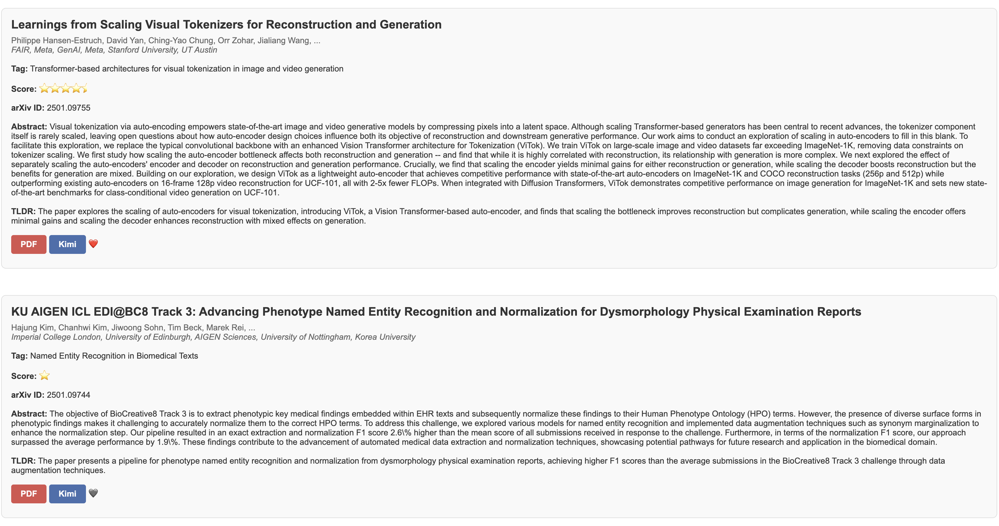

<h3 align="center">arXiv-Daily</h3>

 Recommend new arxiv papers of your interest daily .
      

---

## 🤚 Modify
This repository is modified from [*Zotero-arXiv-Daily*](https://github.com/TideDra/zotero-arxiv-daily/commit/4552754340dab7a4755a9ff5cca6c69aede3d19e).
- Remove all Zotero-related functions; no local LLM is used now.
- Use LLM to tag topics for papers.
- Score papers based on the gathered affiliations.
- Allow specifying the used online LLM (need OpenAI-like interface.)
- Add a Kimi button for reading and summarizing papers (based on the Kimi website).
- Add a Like button for marking papers you are interested in.
- Update the github [page](https://xiangsam.github.io/arxiv-daily/) when sending the email.

## 🧐 About 

*Zotero-arXiv-Daily* finds arxiv papers that may attract you based on the context of your Zotero libarary, and then sends the result to your mailbox📮. It can be deployed as Github Action Workflow with **zero cost**, **no installation**, and **few configuration** of Github Action environment variables for daily **automatic** delivery.

## ✨ Features
- Totally free! All the calculation can be done in the Github Action runner locally within its quota (for public repo).
- AI-generated TL;DR for you to quickly pick up target papers.
- Affiliations of the paper are resolved and presented.
- Links of PDF and code implementation (if any) presented in the e-mail.
- List of papers sorted by relevance with your recent research interest.
- Fast deployment via fork this repo and set environment variables in the Github Action Page.
- Support LLM API for generating TL;DR of papers.
- Ignore unwanted Zotero papers using gitignore-style pattern.

## 📷 Screenshot

## 🚀 Usage
### Quick Start
1. Fork (and star😘) this repo.

2. Set Github Action environment variables.

Below are all the secrets you need to set. They are invisible to anyone including you once they are set, for security.

| Key | Required | Type |Description | Example |
| :--- | :---: | :---  | :---  | :--- |
| ARXIV_QUERY | ✅ | str  | The categories of target arxiv papers. Use `+` to concatenate multiple categories. The example retrieves papers about AI, CV, NLP, ML. Find the abbr of your research area from [here](https://arxiv.org/category_taxonomy).  | cs.AI+cs.CV+cs.LG+cs.CL |
| SMTP_SERVER | ✅ | str | The SMTP server that sends the email. I recommend to utilize a seldom-used email for this. Ask your email provider (Gmail, QQ, Outlook, ...) for its SMTP server| smtp.qq.com |
| SMTP_PORT | ✅ | int | The port of SMTP server. | 465 |
| SENDER | ✅ | str | The email account of the SMTP server that sends you email. | abc@qq.com |
| SENDER_PASSWORD | ✅ | str | The password of the sender account. Note that it's not necessarily the password for logging in the e-mail client, but the authentication code for SMTP service. Ask your email provider for this.   | abcdefghijklmn |
| RECEIVER | ✅ | str | The e-mail address that receives the paper list. | abc@outlook.com |
| MAX_PAPER_NUM | | int | The maximum number of the papers presented in the email. This value directly affects the execution time of this workflow, because it takes about 70s to generate TL;DR for one paper. `-1` means to present all the papers retrieved. | 50 |
| SEND_EMPTY | | bool | Whether to send an empty email even if no new papers today. | True |
| OPENAI_API_KEY | | str | API Key when using the API to access LLMs. You can get FREE API for using advanced open source LLMs in [SiliconFlow](https://cloud.siliconflow.cn/i/b3XhBRAm). | sk-xxx |
| OPENAI_API_BASE | | str | API URL when using the API to access LLMs. If not filled in, the default is the OpenAI URL. | https://api.siliconflow.cn/v1 |
| MODEL_NAME | | str | Model name when using the API to access LLMs. | deepseek-chat |

> [!NOTE]
> The Test-Workflow Action is the debug version of the main workflow (Send-emails-daily), which always retrieve 3 arxiv papers regardless of the date. While the main workflow will be automatically triggered everyday and retrieve new papers released yesterday. There is no new arxiv paper at weekends and holiday, in which case you may see "No new papers found" in the log of main workflow.

Then check the log and the receiver email after it finishes.

By default, the main workflow runs on 22:00 UTC everyday. You can change this time by editting the workflow config `.github/workflows/main.yml`.

